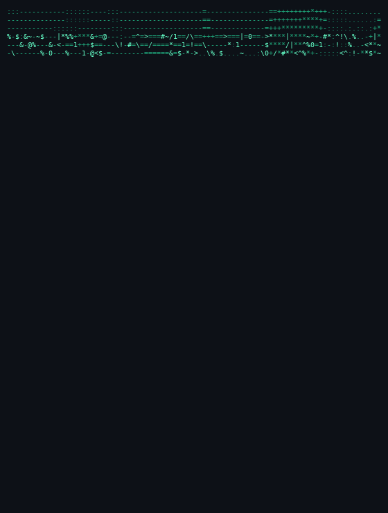
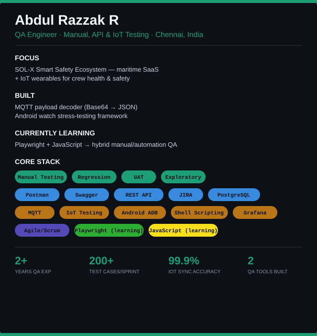

  

|  |  |

  
  
  

  

---

### GitHub activity

  
  

<picture>
  <source media="(prefers-color-scheme: dark)" srcset="https://raw.githubusercontent.com/AbdulRazzakR28/AbdulRazzakR28/output/github-contribution-grid-snake-dark.svg" />
  
</picture>

---

<i>2+ years testing SaaS & IoT products · Currently upskilling in automation ✨</i>

